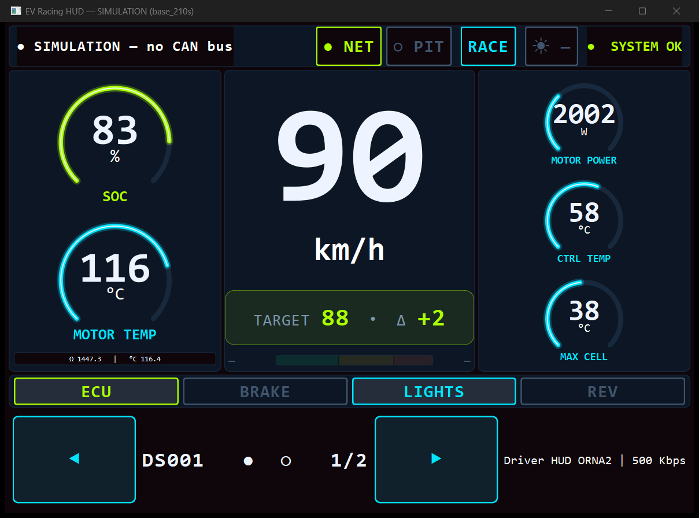
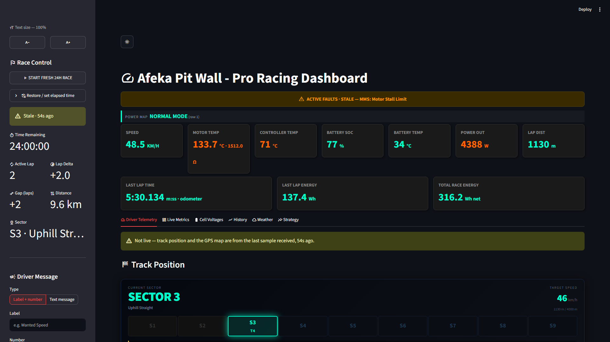

# 🏎️ Afeka Racing — 24H Endurance Telemetry & Strategy System

[](https://www.python.org/)
[](https://www.raspberrypi.org/)
[](https://www.kernel.org/doc/html/latest/networking/can.html)
[](https://firebase.google.com/)
[](https://streamlit.io/)

Telemetry and race-strategy software for the Afeka Solar & Electric Racing Team,
built for the **iESC 24-Hour Endurance Race at Circuit Zolder, Belgium**.

The system links the **car** (a Raspberry Pi reading the vehicle CAN bus) to the
**pit wall** (a laptop dashboard) through the Google Firebase Realtime Database,
giving engineers live battery, motor, temperature, and strategy data.

<table>
<tr>
<td width="50%">

**Driver HUD** — `SolarRace_OS`, bench-simulated (`tools/hud_sim.py`)


</td>
<td width="50%">

**Pit Wall** — `Pit_Dashboard`, sample telemetry


</td>
</tr>
</table>

### New here? Start with these

| I want to… | Go to |
|---|---|
| Understand how the two halves fit together | [System Overview](#-system-overview) below |
| Find my way around the files | [Repository Structure](#-repository-structure) |
| Run the pit dashboard on a laptop | Double-click **`Start Pit Dashboard.bat`**, or [§ B](#b-pit-wall--pit_dashboard-laptop) |
| Run the car software on the Pi | [§ A](#a-car--solarrace_os-raspberry-pi), then [`deploy/README.md`](deploy/README.md) |
| Get CAN working on the Pi | [`docs/PI_CAN_TASK.md`](docs/PI_CAN_TASK.md) |
| Change a gear ratio, lap length, or alarm threshold | `drivetrain.py`, `track.py`, `limits.py` at the repo root — **both** subsystems read them |
| Retune when a gauge goes amber or red | `limits.py`, then re-run `python tools/replay_limits.py` to see how often the new number would have fired |
| Change CAN bitrate / channels / BMS polling / throttle reporting | `SolarRace_OS/config.py` |
| Retune the Eco / Normal / Power zones, or calibrate the throttle pedal | `efficiency.py` at the repo root — **both** subsystems read it |
| Wire up or debug the solar current sensor | [☀ Solar Current Sensor](#-solar-current-sensor-yocto-amp) below |

> **Two things that surprise everyone:**
> 1. `Pit_Dashboard` never talks to Firebase — only `collector.py` does. The dashboard
>    reads the local `telemetry.db` SQLite file. Start the collector first.
> 2. Metrics that were not reported are `NULL` and render as `—`. They are **never** zero;
>    do not coalesce a missing reading to `0` anywhere in this codebase.

---

## 🏁 System Overview

Two subsystems, synchronised through one Firebase node (`live_telemetry`):

```
   ┌─────────────────────── CAR (Raspberry Pi) ───────────────────────┐
   │                                                                   │
   │   can1 @ 500 kbit/s                                               │
   │   └─ MMS  (SiliXcon LYNX motor controller)   IDs 0x600–0x628      │
   │   can0 @ 500 kbit/s                                               │
   │   ├─ BMS  (JBD battery, polled)              IDs 0x100–0x110      │
   │   └─ TEMP (J1939 thermistor module)          ID  0x1839F380       │
   │            │                                                      │
   │            ▼                                                      │
   │   SolarRace_OS  ──►  parsers  ──►  vehicle_state  ──►  PySide6    │
   │   (main.py)                                │           Driver HUD │
   │                                            ▼                      │
   └──────────────────────────────────  Firebase  ────────────────────┘
                                            │
                                            ▼
   ┌──────────────────────────── PIT WALL (laptop) ───────────────────┐
   │   collector.py  ──(RTDB REST stream)──►  telemetry.db (SQLite)    │
   │        the ONLY process that reads Firebase        │              │
   │                                                    ▼              │
   │   Pit_Dashboard (Streamlit, reads SQLite — never Firebase)        │
   │   • Live speed / SoC / battery temp / motor temp / power          │
   │   • Lap / sector tracking + velocity-profile pace guidance        │
   │   • 24h energy-strategy matrix & SoC forecast                     │
   │   • Open-Meteo solar/weather forecast for Zolder                  │
   │   • Filtered CSV export (date/time + BMS/MMS/Temp subsystems)     │
   └───────────────────────────────────────────────────────────────────┘
```

**SolarRace_OS (car / Raspberry Pi)**
- Reads one shared CAN bus and decodes three protocols off it (motor, battery, temperature).
- Polls the JBD BMS (it is master/slave — it only answers when queried).
- Drives a distraction-free **PySide6 driver HUD**.
- Pushes a live telemetry snapshot to Firebase ~once per second.
- Falls back to **replaying a recorded log** when no CAN hardware is present, so the dashboards stay alive for development.

**Pit_Dashboard (pit wall / laptop)**
- `collector.py` is the **single** Firebase client: it streams the append-only
  `telemetry_history` node (RTDB REST / Server-Sent Events) and stores every
  sample into a local **SQLite** file (`telemetry.db`), the pit's source of truth.
  It is idempotent (the RTDB push key is the primary key) and self-heals after a
  pit dropout by resuming the stream from the last stored key.
- The Streamlit dashboard reads **only** from SQLite — it never opens its own
  Firebase connection. History/charts/exports therefore survive page refreshes.
- Computes pace delta vs. the Zolder velocity profile, lap/sector position,
  the 24h energy-strategy matrix and SoC forecast, and the Open-Meteo forecast.
- `export.py` exports history to CSV, filtered by date/time and subsystem
  (BMS / MMS / Temperature / Motion-GPS), from the dashboard or the command line.

---

## 🔌 CAN Bus Topology

The car uses **two independent CAN channels** on a 2-CH HAT, **both at
500 kbit/s** since 2026-08-25. The motor controller sits alone on `can1`; the
battery and the temperature module share `can0`. Message-ID ranges never
overlap, so the parsers can tell the protocols apart regardless of channel:

| Device | Channel | Bitrate | Protocol | Message IDs | Direction |
|--------|---------|---------|----------|-------------|-----------|
| **MMS** (motor) | `can1` | 500 kbit/s | SiliXcon LYNX | `0x600`–`0x628` (11-bit) | broadcast → Pi |
| **MMS throttle** (GPIO0) | `can1` | 500 kbit/s | siliXcon ESC API | `0x147` out, `0x150` in (11-bit) | **Pi requests → ESC reports** |
| **BMS** (battery) | `can0` | 500 kbit/s | JBD query/response | `0x100`–`0x110` (11-bit) | Pi polls → BMS replies |
| **TEMP** (battery temp) | `can0` | 500 kbit/s | J1939 thermistor | `0x1839F380` (29-bit) | broadcast → Pi |

> 🔄 **The MMS moved from 1 Mbit/s to 500 kbit/s on 2026-08-25**, when the
> engineering team reconfigured both it and the BMS. Both ends of a wire have to
> be re-flashed together, so a Pi still running the old `can-up.service` holds
> `can1` at 1 Mbit/s and decodes nothing from it — reinstall the unit and check
> `ip -details link show can1`. The rates now being equal is **not** a licence to
> merge the wires: that is a wiring change, and the BMS poll still only goes out
> on `can0`.

> 🦾 **The throttle is the one signal the car has to ASK for.** Every other
> frame above is broadcast unprompted; the ESC sends nothing about its GPIO
> inputs until the Pi transmits a configuration frame to `0x147` naming the
> input, the sampling period and a reply bank. It then answers on `0x150` in
> **millivolts, big-endian** — the opposite byte order to every LYNX broadcast
> frame. The request is re-sent every 5 s because the ESC forgets it on a power
> cycle. Turn it off with `THROTTLE_GPIO_REQUEST_ENABLED = False` if you would
> rather arm the report once with siliXcon's own tool; the decoder is unchanged
> either way. Details: the GPIO section of `SolarRace_OS/modules/mms_parser.py`.

> 📐 **This split was measured on the car**, with a listen-only bitrate sweep
> plus a live BMS query reply — not assumed. An earlier revision had the MMS on
> `can0`, and that mismatch is precisely what drove `can0` to `BUS-OFF`: at the
> wrong bitrate nothing on the wire ever ACKed a frame. If you change the
> wiring, re-measure; do not infer.

> ⚠️ **Per-wire bitrate:** every device sharing **one wire** must run at that
> wire's bitrate — set per channel by `CAN_BITRATES` in `SolarRace_OS/config.py`
> (**both channels at 500 kbit/s** today). The two channels are independent
> controllers and need not agree with each other, which is what lets a device
> that cannot be reconfigured (the J1939 temp module is often fixed at
> 250 kbit/s) sit on its own channel instead of dragging the whole car down to
> its rate — the reason the map is still per-channel even while the two entries
> match. The BMS baud is user-definable — set it to match whichever channel it is
> wired to. Two channels require a **2-channel HAT** (two independent MCP2515s);
> a single-channel HAT gives you `can0` only.

---

## ☀ Solar Current Sensor (Yocto-Amp)

Measures the DC current the MPPT pushes into the pack — the only *inbound*
energy number on the car. Hardware: a Yoctopuce **Yocto-Amp** (or **Yocto-Amp-C**,
the identical board with a USB-C socket), read by
[`SolarRace_OS/modules/solar_current.py`](SolarRace_OS/modules/solar_current.py).

| Property | Value | Why it matters here |
|----------|-------|---------------------|
| Max continuous | **10 A DC** | **Check the MPPT output rating against this before fitting anything.** |
| Max peak | 17 A DC | Beyond this the reading is meaningless and the shunt is in trouble |
| Insertion impedance | 5 mΩ | 0.5 W at 10 A — negligible loss, but it is a real heat source |
| Terminal block | **26–16 AWG**, 5 mm strip, 0.4 Nm | A thicker charge cable will not physically land in it |
| Isolation | 3 kV r.m.s. USB ↔ sensor | The Pi is NOT exposed to pack potential |
| Reported unit | **milliamps** | Converted to amps once, on the car. Never store mA |
| Refresh | 10 Hz | We poll at 4 Hz; the pit sees it at the 0.5 s Firebase rate |

### ⚠️ Before wiring: confirm the current fits

The Yocto-Amp is a **10 A continuous** device. Take the MPPT's rated maximum
output current — not the array's nominal power, the MPPT's *output spec* — and
check it is comfortably under 10 A. A 1 kW array into a ~48 V pack is roughly
20 A, which is **twice this sensor's continuous rating**: it would overheat the
shunt, and a 5 mΩ resistor cooking inside a sealed box in a race car is a fire
risk, not a measurement problem. If the number is above ~8 A, stop and fit a
hall-effect sensor instead. At a sustained 10 A the PCB already runs ~15 °C above
ambient and Yoctopuce recommend forced airflow.

### Wiring, step by step

1. **Make it safe first.** Open the battery isolator, then isolate the array.
   A solar panel cannot be switched off — it is live whenever light falls on it,
   so either open the array isolator or physically cover the panels. Confirm 0 V
   across the point you are about to cut.
2. **Pick the point.** Anywhere on the conductor between the **MPPT output** and
   the **battery**. The MPPT's positive output lead is the conventional choice.
   Because the sensor is isolated, positive or negative return both work
   electrically — pick whichever gives a shorter, better-supported cable run.
3. **Cut that one conductor and land both ends on the terminal block.** The
   ammeter goes **IN SERIES** — the whole charge current must flow through it.
   Never wire it across the battery or across anything else: a 5 mΩ shunt in
   parallel with a pack is a dead short.
4. **Observe polarity so charging reads positive.** MPPT side → **`+` (measure
   input positive)**; battery side → **`−` (measure input negative)**. Get this
   backwards and the car simply reports negative amps all race — which the
   dashboards deliberately display rather than hide, so you will see it
   immediately and can swap the two wires.
5. **Check the wire fits.** The block takes **16 AWG at the thickest**. A solar
   charge line is often heavier than that. If so, do NOT force strands in: make a
   short 16 AWG pigtail with a properly crimped joint to the main cable, and
   remember the pigtail is now the current-limiting element in that path.
6. **Crimp ferrules on stranded wire, strip 5 mm, torque to 0.4 Nm.** This is a
   race car: a screw terminal that backs out under vibration becomes a
   high-resistance hot spot carrying the full charge current.
7. **Mount the module, not the wires.** Bolt or tie the board to structure so
   its mass and the USB cable's tugging are never carried by the terminal
   screws. Leave it in open air — do not bury it in a sealed box.
8. **Leave the existing fuse in place.** The ammeter protects nothing. The
   charge line still needs its own fuse, and that fuse should be rated at or
   below what the Yocto-Amp can survive.
9. **Restore power** — array last — and verify against a clamp meter before
   trusting the number.

### How the USB side works

The Yocto-Amp is two electrically separate halves on one board. The shunt sits in
the charge line at pack potential; the USB half is powered and read by the Pi;
between them is 3 kV of isolation. **This is why the Pi can safely measure a
line at pack voltage** — there is no galvanic path from the traction system to
the Raspberry Pi, so no ground loop and no shared reference.

Plug it into any **USB-A** port on the Pi 5 (the Pi's own USB-C socket is power
input only — with the Yocto-Amp-C you want a USB-C-to-USB-A cable). It draws
little enough to run from the port directly. **Strain-relieve and secure the
connector**: a USB plug shaken loose is the expected failure here, which is why
`solar_current.py` reconnects on its own and why the pit shows a sensor status
beside the number — "offline" means the cable, "0.00 A" means the weather.

The device is enumerated by `libusb`, so it needs a udev rule before a non-root
process can open it. See [`deploy/README.md`](deploy/README.md) § 6 — without it
the reading is permanently blank and the status reads `no_hub`.

---

## 📂 Repository Structure

The repository root **is** the project root: `SolarRace_OS/` (car) and
`Pit_Dashboard/` (pit wall) sit side by side, with the physics/geometry modules
they *both* import directly at the root.

```text
THE RACE/                             # ← repo root
│
├── drivetrain.py                     # ⭐ SHARED: gear ratio, wheel size, speed_kmh()
├── track.py                          # ⭐ SHARED: lap length, finish-line coordinates
├── limits.py                         # ⭐ SHARED: every alarm threshold + tier colours
├── speed_profile.py                  # ⭐ SHARED: target-speed curves along a lap
│   #  These four live at the ROOT ON PURPOSE. The car and the pit had drifted
│   #  onto different gear ratios and lap lengths and disagreed about speed by
│   #  3.3 %. Both sides now import them by adding the repo root to sys.path
│   #  (as parent-of-their-own-folder), so DO NOT move them into a subfolder
│   #  — every importer breaks. See "Shared modules" below.
│
├── Start Pit Dashboard.bat           # Double-click launcher → Pit_Dashboard/run_pit.bat
├── requirements.txt                  # Shared/root-tool dependencies
│
├── SolarRace_OS/                     # Edge code — runs on the Raspberry Pi
│   ├── main.py                       # Entry point: opens CAN, polls BMS, runs HUD, pushes to Firebase
│   ├── config.py                     # ⭐ Central config: bitrates, connection candidates, BMS poll list
│   ├── can_worker.py                 # CAN QThread + LYNX decoder + driver-HUD signals
│   ├── driver_dash_v2.py             # PySide6 driver HUD (the ACTIVE dashboard, RacingDashboard)
│   ├── dashboard.py                  # Alternate standalone engineering dashboard (pyqtgraph)
│   ├── test_connection.py            # Quick CAN probe — which bus is live + sample frames
│   ├── requirements.txt              # Pi dependencies
│   ├── modules/
│   │   ├── bms_parser.py             # JBD battery decoder (voltage, current, SoC, cells, temps)
│   │   ├── mms_parser.py             # SiliXcon LYNX motor decoder (RPM, power, errors)
│   │   ├── temp_controller_parser.py # J1939 battery-temperature decoder (low/high/avg)
│   │   ├── pt1000.py                 # PT1000 thermistor linearisation
│   │   ├── gps_reader.py             # GPS position via gpsd (background thread)
│   │   ├── solar_current.py          # ☀ MPPT→battery current, Yocto-Amp on USB
│   │   ├── lap_tracker.py            # Lap/sector detection from GPS + wheel distance
│   │   ├── lap_command.py            # Manual lap triggers / pit commands
│   │   └── vehicle_inputs.py         # Throttle, brake, and switch inputs
│   ├── cloud/
│   │   ├── firebase_client.py        # Pushes telemetry to the Realtime DB (throttled)
│   │   └── serviceAccountKey.json    # 🔒 Firebase admin key — SEE SECURITY NOTE BELOW
│   └── data/
│       └── can_dump.txt              # Recorded CAN log, replayed when no CAN hardware is present
│
├── Pit_Dashboard/                    # Pit-wall analytics — runs on an engineer's laptop
│   ├── run_pit.bat                   # Real launcher: finds Python, installs deps, starts both processes
│   ├── collector.py                  # ⭐ The ONLY Firebase client: streams telemetry_history → SQLite
│   ├── pit_dashboard.py              # Streamlit dashboard (reads SQLite ONLY, never Firebase)
│   ├── db.py                         # SQLite schema + idempotent upsert + query helpers
│   ├── constants.py                  # Pit constants; re-exports the shared root modules
│   ├── pit_config.py                 # DB URL, paths, sqlite path, device id
│   ├── strategy_engine.py            # Strategy math, SoC forecast, velocity profile
│   ├── driver_message.py             # Pit → driver messaging
│   ├── weather_service.py            # Open-Meteo Zolder forecast
│   ├── export.py                     # CSV export (date/time + subsystem filters); also a CLI
│   ├── ui.py                         # Shared Streamlit UI helpers
│   ├── assets/pit_dashboard.css      # Dashboard styling
│   ├── .streamlit/config.toml        # Streamlit server/theme settings
│   ├── 210s.xlsx                     # Baseline 210 s Zolder velocity profile
│   ├── requirements_pit.txt          # Pit dependencies
│   ├── serviceAccountKey.json        # 🔒 Firebase admin key — SEE SECURITY NOTE BELOW
│   └── telemetry.db                  # Local SQLite store (gitignored; created by collector.py)
│
├── profiles/                         # Pre-generated target-speed CSVs, one per lap time
│   ├── fast_189s.csv  med_fast_199s.csv  base_210s.csv
│   └── med_slow_220s.csv  slow_231s.csv
│
├── tools/                            # One-off / offline utilities (not part of the live system)
│   ├── check_limits.py               # Headless checks: gauge tiers, blink edges, no-data
│   ├── replay_limits.py              # Replays telemetry.db: how often each tier would fire
│   ├── generate_profiles.py          # Builds profiles/*.csv from Pit_Dashboard/210s.xlsx
│   ├── hud_sim.py                    # Drives the driver HUD without a car, for UI work
│   ├── backfill_columns.py           # Adds new columns to an existing telemetry.db
│   └── fix_vehicle_speed.py          # Re-derives stored speed after a decode fix
│
├── deploy/                           # Raspberry Pi provisioning (systemd + desktop launcher)
│   ├── README.md                     # ⭐ Pi setup guide — read this before touching the Pi
│   ├── can-up.service                # Brings can0/can1 up at boot at the right bitrate
│   ├── solarrace-hud.desktop         # Autostart entry for the driver HUD
│   ├── solarrace-camera.desktop      # Autostart entry for the USB reverse camera
│   ├── start_camera.sh               # Reverse camera on screen 2 (mpv, no Python)
│   └── start_hud.sh / stop_hud.sh    # HUD start/stop scripts
│
└── docs/                             # Standalone task briefs (no code depends on these)
    ├── PI_CAN_TASK.md                # Step-by-step: MMS + BMS on two CAN channels
    └── REACT_MIGRATION_PROMPT.md     # Plan for a future React + FastAPI pit rewrite (NOT built)
```

### Shared modules — the one layout rule

`drivetrain.py`, `track.py`, `limits.py`, and `speed_profile.py` are imported by
both subsystems. Importers locate them by computing the repo root **relative to
their own file** and prepending it to `sys.path`, e.g. in
`Pit_Dashboard/constants.py`:

```python
_REPO_ROOT = os.path.dirname(os.path.dirname(os.path.abspath(__file__)))
if _REPO_ROOT not in sys.path:
    sys.path.insert(0, _REPO_ROOT)
from drivetrain import GEAR_RATIO, WHEEL_CIRCUMFERENCE_METERS, speed_kmh
```

That expression means *"the folder containing my folder."* So the invariant is:
**`Pit_Dashboard/`, `SolarRace_OS/`, and `tools/` must remain exactly one level
below the four shared modules.** Nesting the project inside another folder, or
moving the shared modules into a package, breaks every one of these imports.

Everything else resolves relatively too — the `.bat` launchers use `%~dp0` and
the Python paths are all `__file__`-based — so the repo can be cloned or renamed
anywhere without edits.

---

## ⚙️ Configuration

Almost everything car-side is centralised in **`SolarRace_OS/config.py`**:

| Setting | Purpose |
|---------|---------|
| `CAN_BITRATES` | Per-channel bitrate map — **every device on a channel must match its rate** (`can0: 500_000`, `can1: 500_000`). For SocketCAN this does not set the rate; `ip link` does (see `deploy/can-up.service`), so keep the two in step. |
| `CAN_BITRATE` | Fallback rate for channels absent from `CAN_BITRATES` — in practice the USB-to-CAN adapters, where python-can really does apply it. |
| `THROTTLE_GPIO_*` | The throttle report: whether the Pi asks for it at all, which wire and ESC address, which reply bank, which GPIO, how fast, and how often the request is re-armed. **This is the only place the car transmits to the motor controller** — see the note in the file. |
| `CAN_CANDIDATES` | Connections tried in order: CAN HAT (`socketcan:can0`) first, then a USB-to-CAN adapter. First that opens wins. |
| `BMS_POLL_IDS` / `BMS_POLL_BYTE` / `BMS_POLL_INTERVAL_S` | Which BMS frames to request, the query byte (`0x5A`), and how often (1 Hz). |
| `modules/solar_current.py` | Solar sensor tunables live in the module, not here — same as `gps_reader.py`. Poll rate, rescan interval, plausibility ceiling, and `target_serial` (pin this the moment a SECOND Yoctopuce device joins the car). |
| `efficiency.py` (repo root) | Not in `config.py`, because the **pit reads it too**: the pedal's millivolt calibration and the Eco / Normal / Power boundaries. ⚠️ Every number in it is still a placeholder — nothing has been measured on the car. |
| `SIM_LOG_PATH` | Recorded log replayed when no CAN bus is found. |

To use a USB adapter instead of the HAT, or change channels, just edit
`CAN_CANDIDATES` — no other code changes needed.

---

## 🧰 Hardware

- **Raspberry Pi** (3B+ / 4 / 5) running Raspberry Pi OS.
- **CAN HAT** (MCP2515-based, e.g. Waveshare) — ensure 120 Ω termination is correct.
  *(A USB-to-CAN adapter such as PEAK PCAN-USB also works via `CAN_CANDIDATES`.)*
- **Touchscreen** (7"/10") for the driver HUD.
- **Internet** for the Pi (hotspot / cellular dongle) to reach Firebase.
- **GPS module** (NMEA, USB or GPIO) — read through **gpsd**, not directly. Install
  `gpsd gpsd-clients`, point `/etc/default/gpsd` at the device (`DEVICES="/dev/ttyUSB1"`,
  `GPSD_OPTIONS="-n"`), enable the service, and confirm with `gpspipe -w`. gpsd owns the
  serial port; `gps_reader.py` is one of its clients, so nothing else should open that tty.

---

## 🚀 Installation & Running

### A. Car — SolarRace_OS (Raspberry Pi)

**1. Enable the CAN HAT** in `/boot/firmware/config.txt` (or `/boot/config.txt` on older OS), e.g.:
```
dtparam=spi=on
dtoverlay=mcp2515-can1,oscillator=16000000,interrupt=25
dtoverlay=mcp2515-can0,oscillator=16000000,interrupt=23
dtoverlay=spi-bcm2835-overlay
```

Straight from the Waveshare wiki, including the `spi-bcm2835-overlay` line that is
easy to miss. The interrupt pins come from the board's own table:

| Signal | BCM pin | Purpose |
|--------|---------|---------|
| CS_0   | 8 (CE0)  | CAN_0 chip select |
| INT_0  | **23** (default) / 22 | CAN_0 interrupt |
| CS_1   | 7 (CE1)  | CAN_1 chip select |
| INT_1  | **25** (default) / 24 | CAN_1 interrupt |

The alternates (22 / 24) only apply if the solder pads on the PCB were moved.

> ⚠️ **These are the Waveshare 2-CH CAN HAT pins: can0 = GPIO23, can1 = GPIO25.**
> This file previously listed `can0 ... interrupt=25` and no can1 line at all — those
> are the settings for the **single-channel** RS485 CAN HAT, which is a different
> board. On the 2-CH HAT that binds can0 to can1's interrupt line, so can0 either
> never appears or behaves erratically. Check your own `config.txt` against this.

The 2-CH HAT carries **two independent MCP2515 controllers** (plus SN65HVD230
transceivers), which is what makes per-channel bitrates possible — can0 and
can1 are genuinely separate hardware, not one controller time-shared. Both run
at 500 kbit/s today, but each could be set independently tomorrow.

Each channel also has a **switchable 120 Ω termination jumper**. A CAN bus needs
exactly two terminators, one at each physical end. Too few (or too many) causes
reflections, error frames, and eventually `BUS-OFF`. With the bus unpowered,
measure across CANH/CANL: **~60 Ω is correct** (two 120 Ω in parallel). 120 Ω
means a terminator is missing; 40 Ω means there is one too many.

### Two hardware gotchas from the vendor

**VIO jumper must be set to 3.3 V.** The HAT ships with a selectable 3.3 V/5 V
level translator and the Pi is a 3.3 V device. Waveshare: *"The working voltage
level of Raspberry Pi is 3.3V, therefore we need to set the VIO of 2-CH CAN HAT
to 3.3V."* Wrong position gives marginal, flaky signalling rather than a clean
failure.

**Use the standoffs.** On a 2B/3B/4B the back of the CAN screw terminal can
touch the HDMI connector and short out. Waveshare calls this out explicitly and
ships a booster seat and nylon post for it. A short here kills the channel in a
way no amount of software debugging will explain.

Reboot after editing `config.txt`.

### Nothing runs at 1 Mbit/s any more

Waveshare's own FAQ: *"During high-speed communication, the data baud rate may
not reach the nominal maximum rate ... Users need to ensure stability and select
a suitable communication speed according to actual measurements."*

`can1` used to carry the MMS at 1 Mbit/s, where that caveat bites hardest:
isolated transceivers add propagation delay and 1 Mbit/s leaves little timing
margin over any real cable length. Since 2026-08-25 the MMS runs at 500 kbit/s
like everything else on the car, which removes that whole class of marginal
failure — so **do not raise a channel back to 1 Mbit/s** without re-flashing
the device on it and re-measuring.

Note the `BUS-OFF` history on this car had a simpler cause than vendor timing
margin: `can0` was being brought up at 1 Mbit/s while the devices actually on it
(BMS + temp module) ran at 500 kbit/s, so nothing ever ACKed and the controller
walked itself to `BUS-OFF`. Fixing the channel/bitrate mapping fixed that. A
bitrate that does not match the device is still the first suspect whenever a
channel goes to `BUS-OFF` with the wiring and termination checked out.

**2. Bring each bus up** at *its own* configured bitrate (see
`config.CAN_BITRATES`; every device on a given wire must agree with that wire):
```bash
sudo ip link set can0 up type can bitrate 500000 listen-only off   # BMS + temp
sudo ip link set can0 txqueuelen 65536
sudo ip link set can1 up type can bitrate 500000 listen-only off   # MMS
sudo ip link set can1 txqueuelen 65536
```
To make it automatic at boot, install the ready-made unit — do not hand-write one:
```bash
sudo cp deploy/can-up.service /etc/systemd/system/
sudo systemctl daemon-reload
sudo systemctl enable --now can-up.service
```
This is also what lets the driver HUD start at boot without needing `sudo`.
See [deploy/README.md](deploy/README.md) for the full car setup.

**3. Install dependencies and run** — from the **repo root**, not `SolarRace_OS/`
(`main.py` opens the Firebase key by a relative path, so it silently fails to
reach the cloud from anywhere else):
```bash
pip install -r SolarRace_OS/requirements.txt   # python-can, firebase-admin, PySide6
python SolarRace_OS/main.py
```
On Raspberry Pi OS Bookworm the system Python is "externally managed" and pip
will refuse — use a venv, and see [deploy/README.md](deploy/README.md) for the
full setup including auto-boot.

**Check the bus before launching the full app:**
```bash
python test_connection.py   # reports which connection is live + sample frames
candump can0                # raw view (BMS frames appear only once main.py polls)
```

> **Graceful degradation:** if no CAN connection opens, `main.py` automatically
> replays `data/can_dump.txt` so the HUD and cloud sync keep working for testing.

### B. Pit wall — Pit_Dashboard (laptop)

Run from the **repo root** (`THE RACE`), just like `SolarRace_OS` — no need to
`cd` into the folder (all pit paths resolve relative to the package):

```bash
pip install -r Pit_Dashboard/requirements_pit.txt   # streamlit, pandas, matplotlib, requests, google-auth, openpyxl

# 1. Start the collector FIRST — it ingests Firebase into telemetry.db.
python Pit_Dashboard/collector.py

# 2. In a second terminal, start the dashboard (reads telemetry.db only).
streamlit run Pit_Dashboard/pit_dashboard.py
```

(You can still `cd Pit_Dashboard` and run `python collector.py` /
`streamlit run pit_dashboard.py` if you prefer.)

**One-click (Windows):** instead of the two commands above, just run
`run_pit.bat` — it opens the collector and the dashboard in two windows for you.
SQLite needs no install or setup: it's built into Python, and `telemetry.db` plus
its table are created automatically on first run.
The dashboard opens at `http://localhost:8501`. If it shows *"No data yet — is
collector.py running?"*, start the collector. The collector backfills all history
on first run and, after any pit-side network drop, resumes from the last stored
sample (catch-up via `orderBy="$key"&startAt`), so no samples are lost as long as
the car keeps pushing to `telemetry_history`.

**Export.** The dashboard's Export panel produces a clean, readable **Excel
workbook** (`.xlsx`): a formatted **Data** sheet (human-friendly columns with
units, frozen header, filter), a **Charts** sheet of history graphs, and a
**Faults** sheet. The systems multiselect picks which columns/charts/sheets
appear. (Internal keys, redundant timestamps, and the raw fault columns from the
old CSV dump are gone — no more `#NAME?` in Excel.)

**From the command line** (same filters; output format follows the `--out`
extension — `.xlsx` → workbook, anything else → raw CSV):
```bash
python export.py --out race.xlsx                        # Excel workbook (everything)
python export.py --out race.csv                         # raw CSV (machine use)
python export.py --out batt.xlsx --group "BMS (battery)" # one subsystem
python export.py --out window.xlsx --start 2026-06-18T09:00 --end 2026-06-18T11:00
python export.py --list-metrics                         # show metrics & groups
```

---

## 📡 Telemetry Data Model

`main.py` publishes to **two** Firebase nodes each push (~1 Hz):

* **`live_telemetry`** — a single snapshot, **overwritten** every push (the "now").
* **`telemetry_history`** — the same payload `.push()`ed under an auto-generated
  chronological key, **append-only** (nothing is overwritten). This node is what
  the pit collector streams to build local history and to catch up after a drop.

Both carry the identical payload shape shown below. The pit `collector.py` reads
`telemetry_history` only, keying each SQLite row on the RTDB push id so replays
are idempotent.

```jsonc
live_telemetry/
  timestamp: <unix seconds>
  car_data:
    battery:           // JBD BMS
      bms_voltage_V, bms_current_A, bms_remaining_Ah,
      bms_full_capacity_Ah, bms_cycles, bms_soc_percent,
      bms_has_error, bms_error_code, bms_protections[], bms_balancing_active,
      bms_string_count, bms_ntc_count,
      bms_temp_1_C, bms_temp_2_C, bms_temp_3_C,
      bms_cell_01_V ... bms_cell_NN_V
    motor:             // SiliXcon LYNX MMS
      mms_rpm, mms_power_W, mms_temperature_C,
      mms_estimated_soc_percent, mms_measured_voltage_V,
      mms_has_error, mms_error_code,
      odometer_m, calculated_lap
    temp_controller:   // J1939 battery-temperature module
      battery_temp_C (= average), battery_temp_avg_C,
      battery_temp_low_C, battery_temp_high_C, temp_module
    solar:             // live from the Yocto-Amp on USB (solar_current.py)
      solar_current_A,   // AMPS (the sensor reports mA; converted on the car).
                         // null — never 0 — when the sensor is not reporting
      solar_sensor_status,  // online | offline | searching | no_hub |
                            // no_library | implausible | error
      solar_sensor_serial
    gps:               // live from gpsd (gps_reader.py)
      lat, lon,        // ABSENT entirely when there is no fix — never 0,0
      fix_mode (2=2D, 3=3D), alt_m, speed_kmh, track_deg,
      sats_used, fix_age_s, stale
```

**GPS is published independently of CAN.** Telemetry is normally pushed when a CAN
frame is decoded, so a quiet bus used to mean no position at all. `main.py` also
publishes every `GPS_PUBLISH_INTERVAL_S` whenever a fix exists, so the pit map works
with the car parked and the bus down — which is how you check it before a race. With
no fix nothing extra is sent, so a car without GPS behaves exactly as before.
The pit stores only `lat`/`lon` as columns; the rest is kept in `raw_json`.

**BMS polling:** the JBD BMS is master/slave — it stays silent until queried.
`main.py` transmits each `BMS_POLL_IDS` frame (the ID carrying a single `0x5A` byte)
once per second; the BMS replies on the same ID and those replies are decoded normally.

---

## 🔒 Security & Track Notes

1. **Firebase keys** — `serviceAccountKey.json` (Firebase Admin SDK) is required in both
   `SolarRace_OS/cloud/` and `Pit_Dashboard/` (the two copies are identical). Both are
   **deliberately committed to this repository**, so that a teammate cloning it gets a
   working setup with no extra setup step. That is a conscious trade-off, and it means:
   - **This repository must stay private.** The file contains a live RSA private key with
     admin access to the `solar-race-telemetry` Realtime Database.
   - If the repo is ever made public, forked outside the team, or the key otherwise leaks,
     **rotate it** in the Google Cloud console (IAM → Service Accounts → Keys). Removing
     the file in a later commit is *not* sufficient — it stays in git history.
   - `.gitignore` intentionally does **not** list this file, because ignoring an
     already-tracked file has no effect and would be misleading.
2. **Track adaptation** — the velocity profile, sector layout, and weather coordinates are
   set for **Circuit Zolder (4000 m)**. For another venue, update the track constants in the
   pit dashboard and the coordinates in `weather_service.py` / `fetch_zolder_weather`.

---

*Afeka Solar & Electric Racing Team — telemetry & strategy.*
